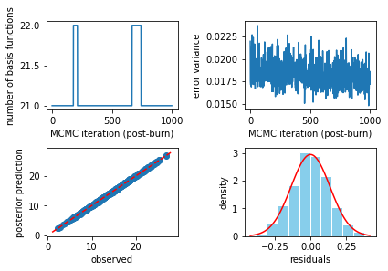
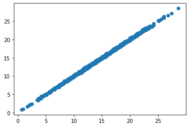
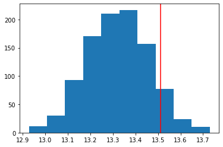

In this example, we generate data from the Friedman function at fit a model with `pyBASS`.


```python
import pyBASS as pb
import numpy as np
import matplotlib.pyplot as plt
```


```python

# Friedman function (Friedman, 1991, Multivariate Adaptive Regression Splines)
def f(x):
    return (10. * np.sin(np.pi * x[:, 0] * x[:, 1]) + 20. * (x[:, 2] - .5) ** 2 
            + 10 * x[:, 3] + 5. * x[:, 4])


n = 500 # sample size
p = 10 # number of predictors (only 5 are used)
x = np.random.rand(n, p) # training inputs
xx = np.random.rand(1000, p) # test inputs
y = f(x) + np.random.normal(size=n) * 0.1 # noisy training outputs
ftest = f(xx)
ytest = ftest + np.random.normal(size=1000) * 0.1 # noisy test outputs

```

Fit the BMARS model with and see the results with


```python
mod = pb.bass(x, y)
mod.plot()
```

    BASS MCMC Complete. Time: 3.236959 seconds.


    

    


The following gives the posterior predictions of the BMARS mean model.


```python
fpred = mod.predict(xx)
plt.scatter(ftest, fpred.mean(axis=0)) # posterior mean prediction vs noisless test outputs
plt.show()
```


    

    


To get full prediction uncertainty, use the `nugget=True` option.  For instance, below we predict at just one new input setting.  The distribution of predictions represents both uncertainty in the BMARS mean as well as predictive variance (e.g., measurement error).


```python
ypred = mod.predict(xx, nugget=True)
plt.hist(ypred[:, 40])
plt.axvline(ytest[40], color='red')
plt.show()
```


    

    


We can calculate the empirical coverage of the uncertainty from our test set predictions by forming a probability interval for each prediction (in this case, 95%), and counting how many intervals capture the corresponding true values.


```python
quantiles = np.quantile(ypred, [0.025, .975], axis=0)
np.mean((quantiles[0] < ytest) * (quantiles[1] > ytest))
```


    0.947


